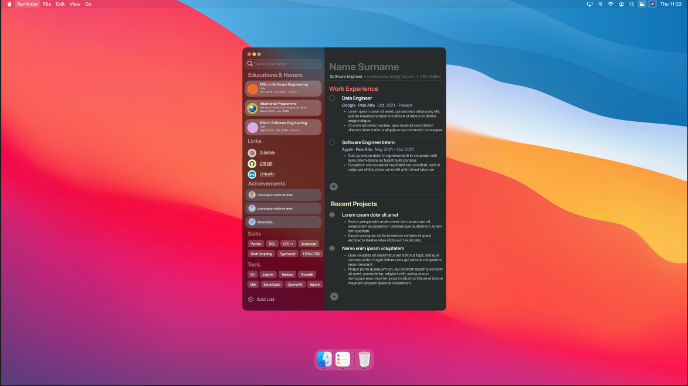

# Portfolio

# Présentation des idées :

Étant amoureux du design et de l'ergonomie des systèmes Mac OS, j'ai décidé d'orienter mon portfolio vers ce style.
Le but est de faire de ce portfolio un projet a part entière en JavaScript, me permettant par la même occasion d'apprendre et de m'exercer sur ce language.

**Les idées :**
- Design _MacOS_
- _"Mini OS"_ codé en JavaScript avec plusieurs _"App"_, qui permettent d'afficher (Projets, CV, et présentation).
- Écran de chargement à l'ouverture du site, comme un bootloader

**Capture d'écrans pour idées :**

## Étapes du projet :

### Création du visuel de la page (HTML, CSS) :

**Captures de l'avancement :**
